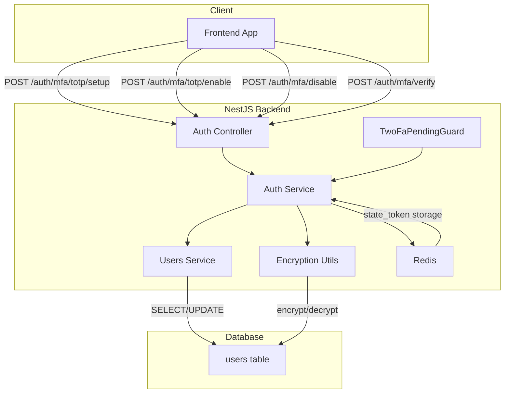
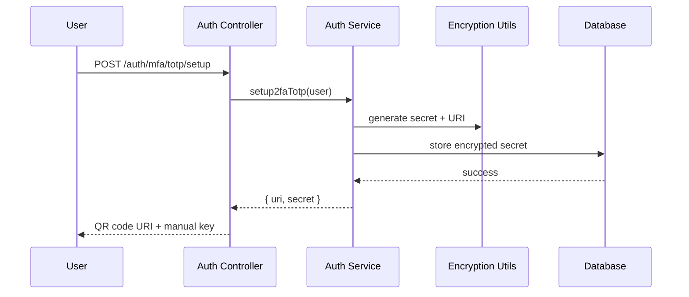
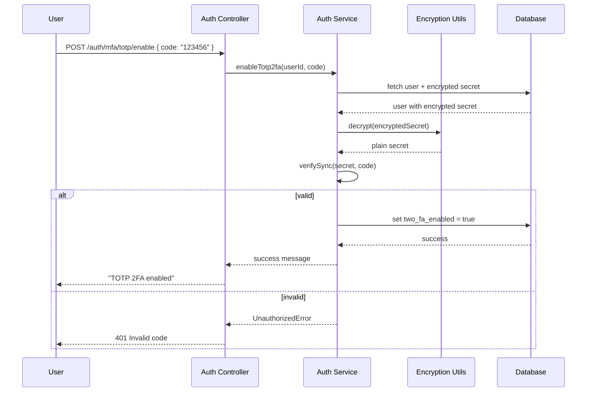
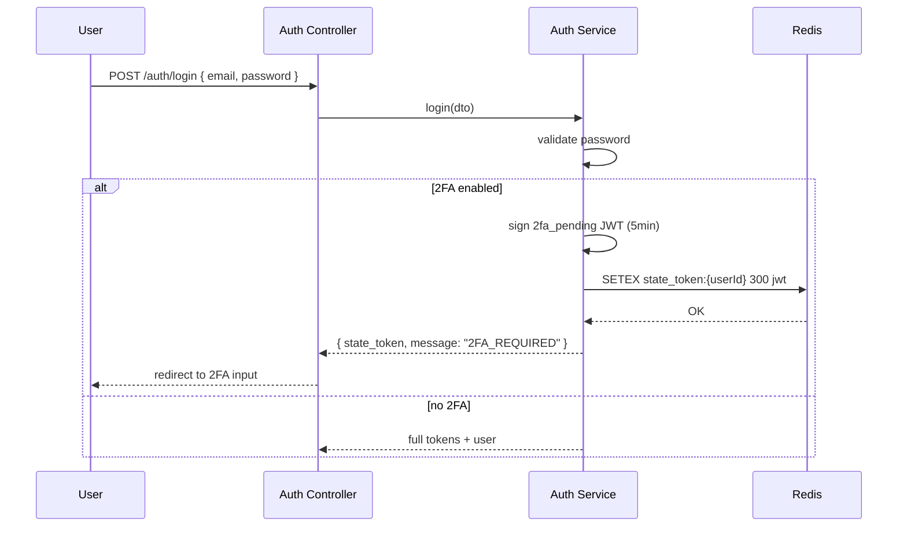
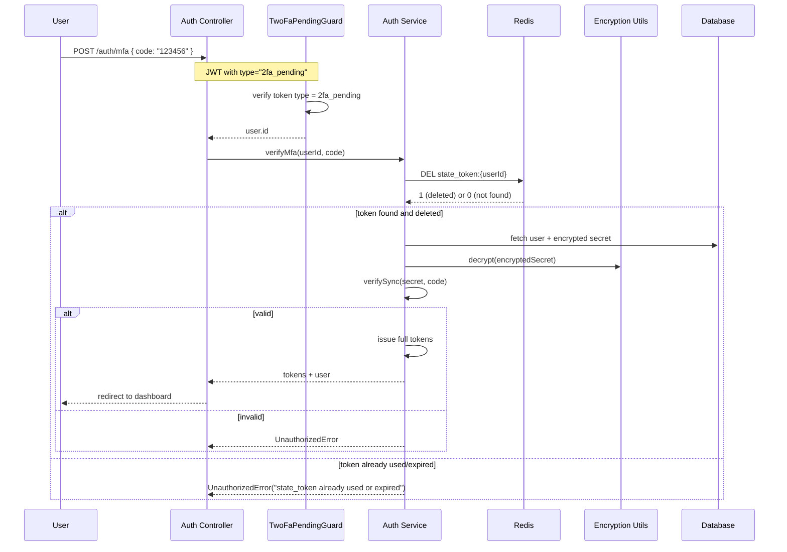
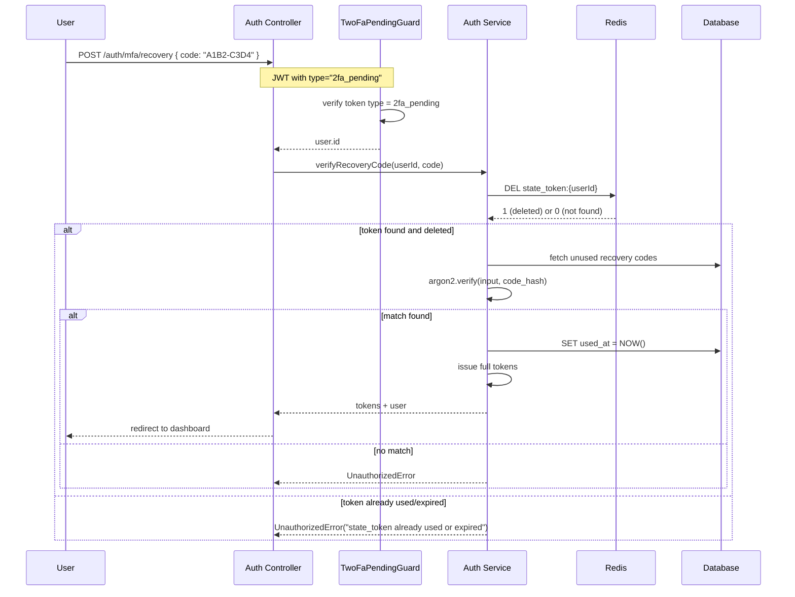
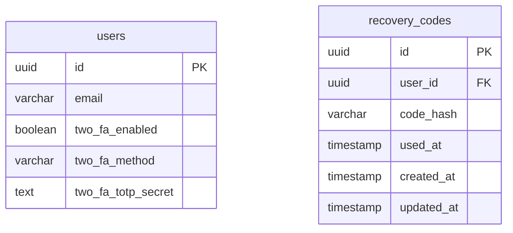

# Multi-Factor Authentication System Design

## 1. Overview

The MFA system adds an additional security layer to user authentication. Users can enable 2FA via TOTP (Time-based One-Time Password) using an authenticator app (Google Authenticator, Authy, etc.), and receive 8 recovery codes as a backup. During login, after verifying their password, users must provide either a TOTP code or a recovery code to complete authentication.

## 2. Architecture



## 3. Components

| Component | Responsibility |
|-----------|----------------|
| AuthController | Exposes 2FA and MFA endpoints, validates DTOs |
| AuthService | TOTP/recovery code verification, secret generation, token issuance |
| UsersService | Persists 2FA state and encrypted secrets to database |
| EncryptionUtils | AES-256-GCM encryption for TOTP secrets |
| TwoFaPendingGuard | Validates temporary 2FA pending JWT tokens |
| RecoveryCode Entity | Stores hashed recovery codes, tracks used status |

## 4. Data Flow

### 4.1 Setup TOTP



### 4.2 Enable TOTP (Verify First Code)



### 4.3 Login with 2FA



### 4.4 Verify TOTP After Login



### 4.5 Verify Recovery Code After Login



## 5. Database Schema



**Users table:**
- `two_fa_enabled`: Boolean flag indicating if 2FA is active
- `two_fa_method`: Enum (`'totp'`) - supports future methods (email, SMS)
- `two_fa_totp_secret`: Encrypted TOTP secret (IV:AuthTag:Ciphertext)

**Recovery codes table:**
- `code_hash`: Argon2 hashed recovery code (plaintext never stored)
- `used_at`: Timestamp when code was used (null = unused)

## 6. API Endpoints

| Endpoint | Method | Auth | Description |
|----------|--------|------|-------------|
| `/auth/mfa/totp/setup` | POST | JWT | Generate TOTP secret + QR URI |
| `/auth/mfa/totp/enable` | POST | JWT | Verify first code, enable 2FA, returns 8 recovery codes |
| `/auth/mfa/disable` | POST | JWT | Verify password, disable 2FA, log out all sessions |
| `/auth/mfa` | POST | 2FA Pending JWT | Verify TOTP code, issue tokens |
| `/auth/mfa/recovery` | POST | 2FA Pending JWT | Verify recovery code, issue tokens |
| `/auth/mfa/recovery-codes/regenerate` | POST | JWT | Verify password, invalidate old codes, generate 8 new ones, log out all sessions |

## 7. Security Considerations

### 7.1 Secret Encryption
- Algorithm: AES-256-GCM (authenticated encryption)
- Key: 32-byte key from `TOTP_ENCRYPTION_KEY` env (64 hex chars)
- IV: 12 random bytes per encryption
- Format: `iv:authTag:ciphertext` (colon-separated hex)

### 7.2 Token Security
- 2FA pending token: 5-minute expiry, type claim = `2fa_pending`
- Single-use enforcement: Stored in Redis (`state_token:{userId}`) with 5-minute TTL
- On verify: Redis key deleted before processing; if key missing → reject as "already used or expired"
- If Redis is unavailable: Falls back to JWT-only (token valid until expiry)

### 7.3 Recovery Codes
- Generated on 2FA enable: 8 codes in format `XXXX-XXXX` (16 chars)
- Stored as Argon2 hashes (plaintext never persisted)
- One-time use: after successful login, `used_at` timestamp is set
- Shown once to user on enable; regeneration invalidates all old codes
- Can be used as alternative to TOTP in `/auth/mfa/recovery`
- Regeneration requires password authentication and logs out all sessions

### 7.4 Attack Mitigations
- Rate limiting on verify endpoint (prevent brute force)
- 30-second time window for TOTP validation (standard RFC 6238)
- Encrypted secrets at rest (not plaintext)
- Argon2 for password and recovery code hashing

## 8. Edge Cases

| Scenario | Handling |
|----------|----------|
| User loses authenticator | Use recovery code instead of TOTP at `/auth/mfa/recovery` |
| All recovery codes used | Prompted to regenerate new codes (requires password) |
| Clock skew on device | 1 window before/after current time (90s total) |
| Re-setup while enabled | Allowed - generates new secret, invalidates old |
| Disable 2FA without valid password | Rejected - requires current password |
| Regenerate recovery codes | Requires password, logs out all sessions |

## 9. Future Considerations

1. **Email 2FA**: Alternative method using email OTP
2. **SMS 2FA**: Phone-based OTP (requires Twilio integration)
3. **2FA Required Policy**: Admin can force 2FA for organization members
4. **Session Management**: View/revoke 2FA sessions
5. **Login Audit Logs**: Track when recovery codes are used

## 10. Configuration

```env
# Required for TOTP secret encryption
TOTP_ENCRYPTION_KEY=64-character-hex-string
```

## 11. Dependencies

- `otplib`: TOTP generation and verification
- `crypto` (Node.js built-in): AES-256-GCM encryption
- `@nestjs/jwt`: Token management
- `ioredis`: Redis client for state_token single-use enforcement