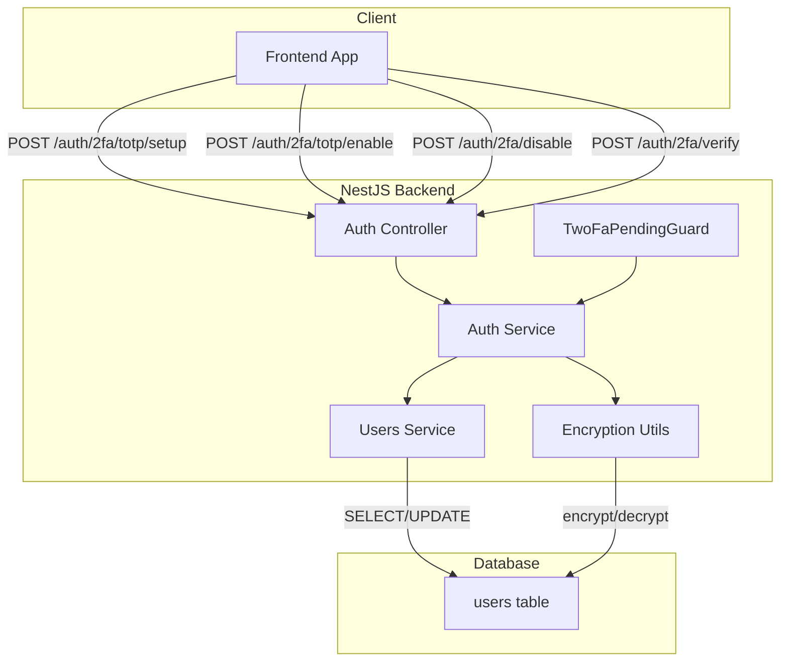
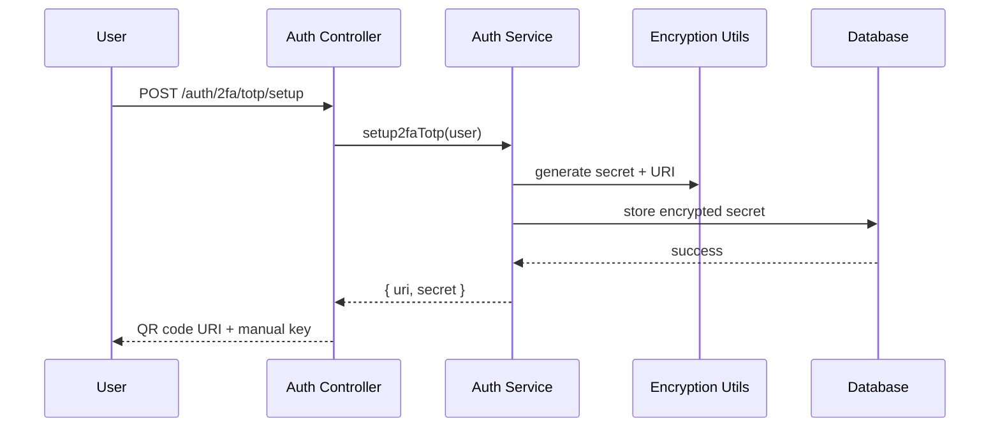
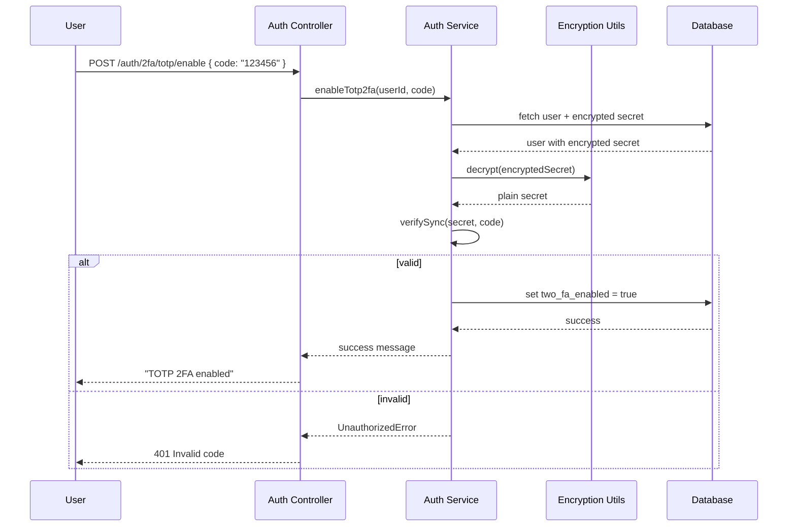
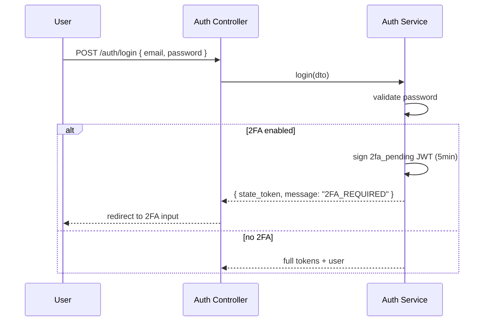
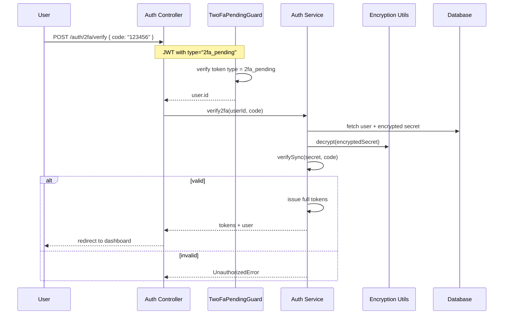
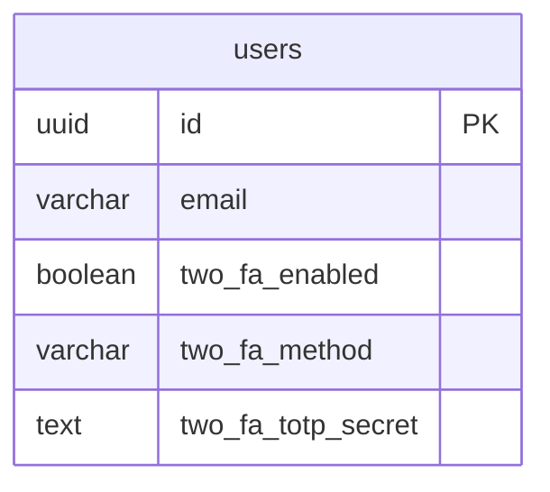

# TOTP Two-Factor Authentication System Design

## 1. Overview

The TOTP (Time-based One-Time Password) 2FA system adds an additional security layer to user authentication. Users enable 2FA by linking an authenticator app (Google Authenticator, Authy, etc.), then must provide a 6-digit code during login after verifying their password.

## 2. Architecture



## 3. Components

| Component | Responsibility |
|-----------|----------------|
| AuthController | Exposes TOTP endpoints, validates DTOs |
| AuthService | TOTP secret generation, code verification, token issuance |
| UsersService | Persists 2FA state and encrypted secrets to database |
| EncryptionUtils | AES-256-GCM encryption for TOTP secrets |
| TwoFaPendingGuard | Validates temporary 2FA pending JWT tokens |
| User Entity | Stores `two_fa_enabled`, `two_fa_method`, `two_fa_totp_secret` |

## 4. Data Flow

### 4.1 Setup TOTP



### 4.2 Enable TOTP (Verify First Code)



### 4.3 Login with 2FA



### 4.4 Verify TOTP After Login



## 5. Database Schema



**Fields:**
- `two_fa_enabled`: Boolean flag indicating if 2FA is active
- `two_fa_method`: Enum (`'totp'`) - supports future methods (email, SMS)
- `two_fa_totp_secret`: Encrypted TOTP secret (IV:AuthTag:Ciphertext)

## 6. API Endpoints

| Endpoint | Method | Auth | Description |
|----------|--------|------|-------------|
| `/auth/2fa/totp/setup` | POST | JWT | Generate TOTP secret + QR URI |
| `/auth/2fa/totp/enable` | POST | JWT | Verify first code, enable 2FA |
| `/auth/2fa/disable` | POST | JWT | Verify code, disable 2FA |
| `/auth/2fa/verify` | POST | 2FA Pending JWT | Verify code, issue tokens |

## 7. Security Considerations

### 7.1 Secret Encryption
- Algorithm: AES-256-GCM (authenticated encryption)
- Key: 32-byte key from `TOTP_ENCRYPTION_KEY` env (64 hex chars)
- IV: 12 random bytes per encryption
- Format: `iv:authTag:ciphertext` (colon-separated hex)

### 7.2 Token Security
- 2FA pending token: 5-minute expiry, type claim = `2fa_pending`
- Single-use: Token invalidated after successful verification

### 7.3 Attack Mitigations
- Rate limiting on verify endpoint (prevent brute force)
- 30-second time window for TOTP validation (standard RFC 6238)
- Encrypted secrets at rest (not plaintext)

## 8. Edge Cases

| Scenario | Handling |
|----------|----------|
| User loses authenticator | Recovery flow TBD (future: backup codes, email reset) |
| Clock skew on device | 1 window before/after current time (90s total) |
| Re-setup while enabled | Allowed - generates new secret, invalidates old |
| Disable without valid code | Rejected - requires current TOTP code |

## 9. Future Considerations

1. **Recovery Codes**: Generate 8 single-use backup codes on 2FA enable
2. **Email 2FA**: Alternative method using email OTP
3. **SMS 2FA**: Phone-based OTP (requires Twilio integration)
4. **2FA Required Policy**: Admin can force 2FA for organization members
5. **Session Management**: View/revoke 2FA sessions

## 10. Configuration

```env
# Required for TOTP secret encryption
TOTP_ENCRYPTION_KEY=64-character-hex-string
```

## 11. Dependencies

- `otplib`: TOTP generation and verification
- `crypto` (Node.js built-in): AES-256-GCM encryption
- `@nestjs/jwt`: Token management